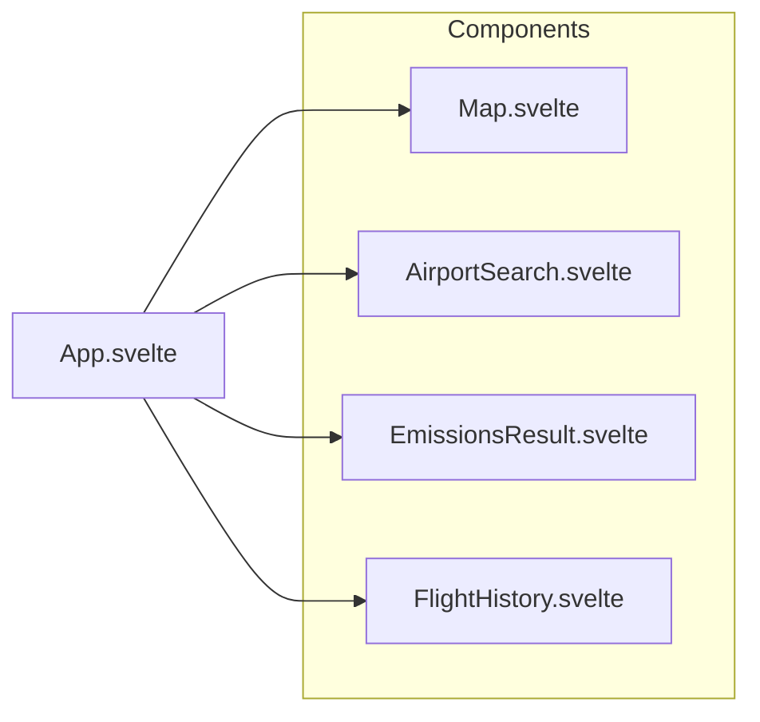

# Flight Emissions Calculator: Design Documentation

An interactive web application to calculate and visualize the environmental impact of air travel.

## Architecture

### Frontend Components



### Data Flow


## Technical Stack

- **Frontend**: Svelte + TypeScript
- **Styling**: Tailwind CSS
- **Mapping**: Leaflet
- **Build**: Vite
- **Package Manager**: Bun

## Key Features

1. **Airport Search**
   - Dynamic search with keyboard navigation
   - Popularity-based ranking
   - Prevents duplicate selection

2. **Map Visualization**
   - Interactive flight paths
   - Automatic zoom and centering
   - Custom markers

3. **Emissions Calculation**
   - Multiple comparison metrics
   - Academic references
   - Interactive tooltips

## Development

```bash
# Start development
bun run dev

# Build for production
bun run build

# Update airport data
bun run update-airports
```
