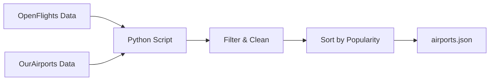

# Airport Data Update Scripts

Scripts for updating the airport database used by the Flight Emissions Calculator.

## Data Flow



## Usage

```bash
# Install dependencies
uv pip install -r requirements.txt

# Update airport data
python update_airports.py

# Preview changes (no file writes)
python update_airports.py --dry-run
```

## FAQ

### Why use both OpenFlights and OurAirports?
- OpenFlights: Better coordinates and city names
- OurAirports: Better metadata and status updates
- Combined for accuracy and completeness

### How is the data combined?
1. Match airports using IATA codes
2. Use OpenFlights for coordinates and names
3. Use OurAirports for validation and metadata
4. Filter out non-operational airports

### What about airport traffic data?
We use [ACI World Airport Traffic Dataset (2021)](https://aci.aero/2022/07/25/final-data-released-top-20-busiest-airports-confirmed/) for ranking airports by popularity in search results.
