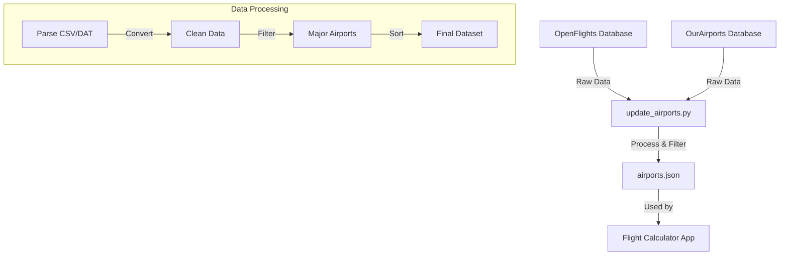

# Scripts Documentation

This directory contains utility scripts for the Flight Emissions Calculator project.

## Airport Data Management

### Overview

The `update_airports.py` script manages the airport database used by the application. It fetches, processes, and maintains airport data from two primary sources:



### Components

1. **Data Sources**
   - OpenFlights: Basic airport information and coordinates
   - OurAirports: Comprehensive airport details and classifications

2. **Data Processing**
   - Validates IATA codes
   - Converts country codes to full names
   - Filters for major international airports
   - Sorts by country and city
   - Handles data cleaning and deduplication

3. **Output**
   - Generates `public/data/airports.json`
   - Creates automatic backups
   - Supports dry-run mode for testing

### Usage

```bash
# Basic update
python update_airports.py

# Dry run with preview
python update_airports.py --dry-run

# Verbose output with custom preview limit
python update_airports.py --dry-run -v --preview-limit 100

# Custom output location
python update_airports.py -o custom/path/airports.json
```

### Options

- `--dry-run`: Preview changes without writing files
- `-v, --verbose`: Enable detailed logging
- `--preview-limit`: Number of airports to show in preview (default: 50)
- `-o, --output`: Custom output path for the JSON file

### Dependencies

- Python 3.8+
- Required packages:
  - `requests`: HTTP requests
  - `click`: CLI interface
  - `loguru`: Logging
  - `pycountry`: Country name resolution

### Data Format

The output JSON structure for each airport:
```json
{
  "name": "Airport Name",
  "city": "City Name",
  "country": "Country Name",
  "iata_code": "XXX",
  "latitude": 00.000,
  "longitude": 00.000
}